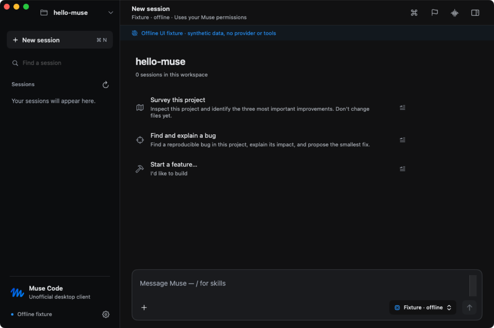
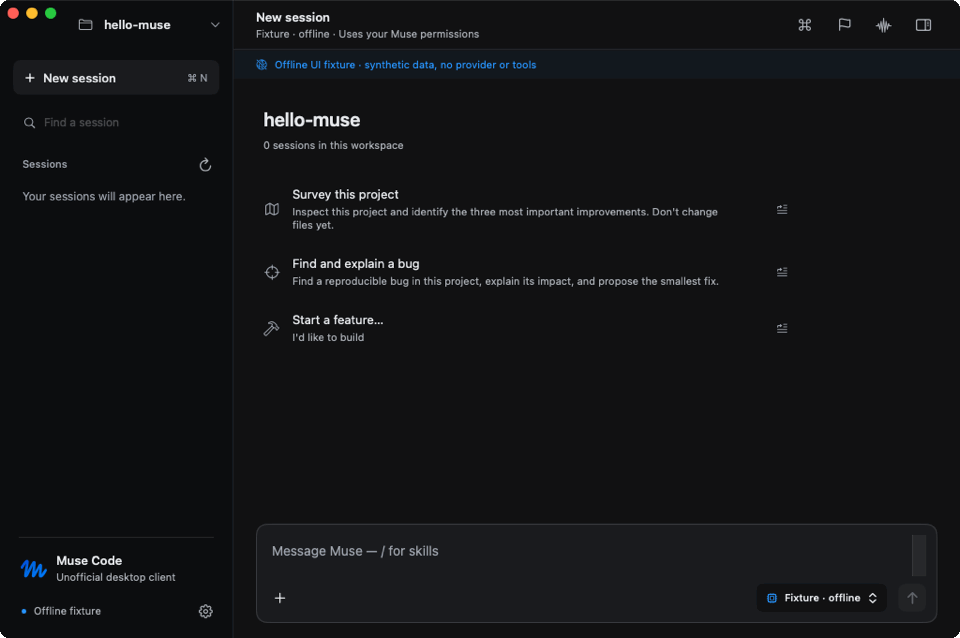
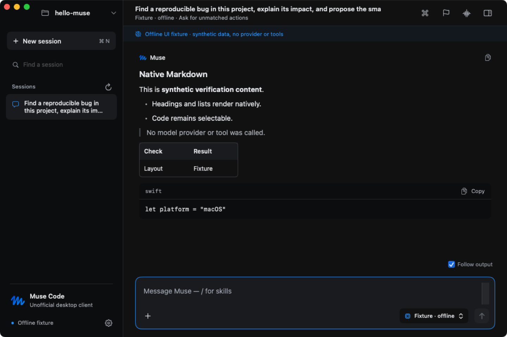
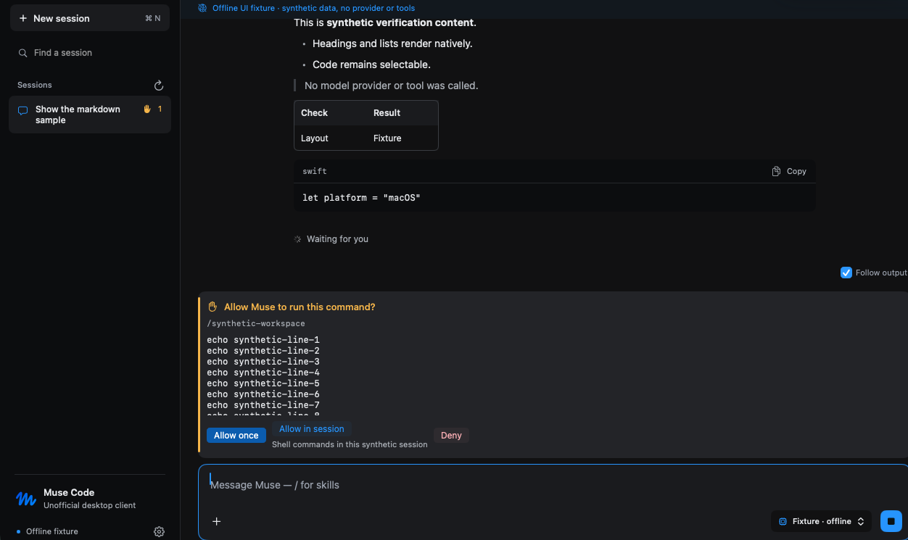
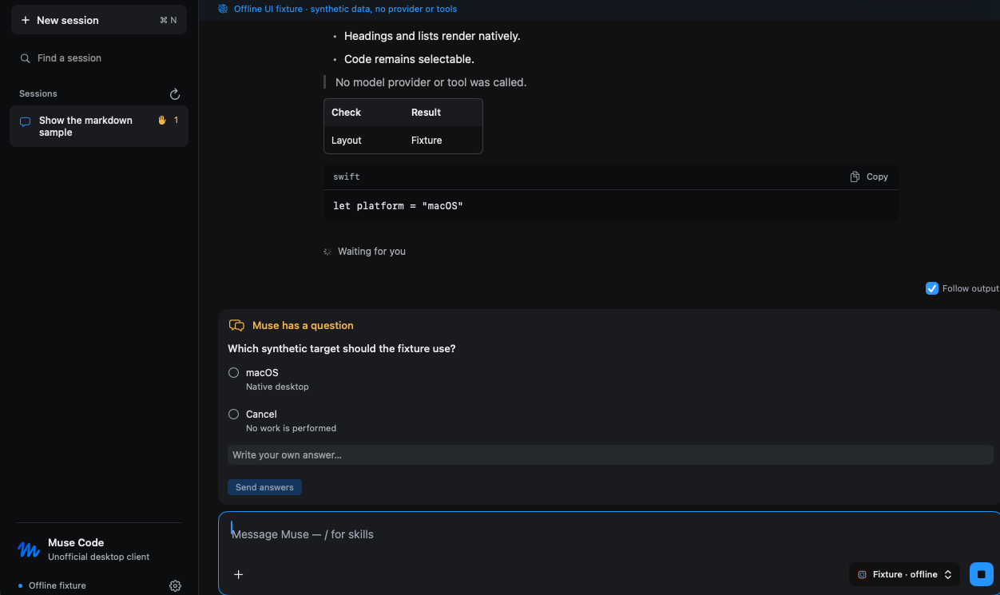
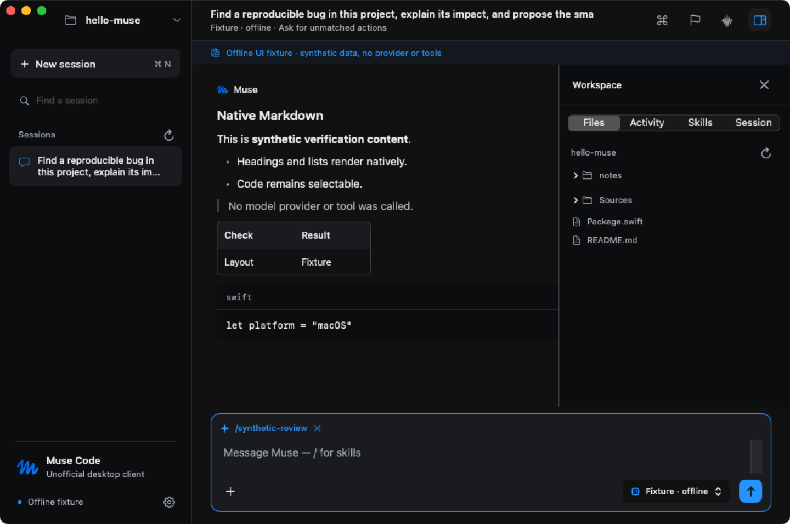
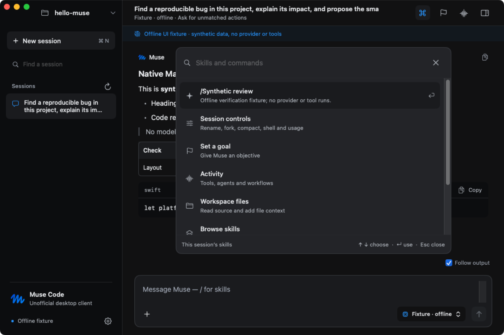
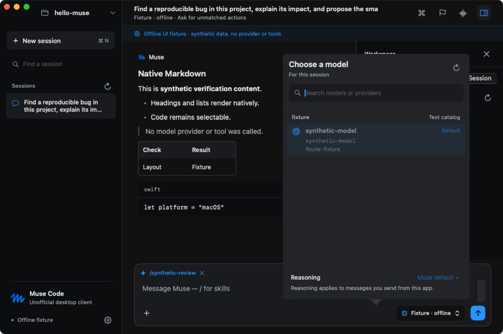

<div align="center">

<br>


<h1>Muse Code Desktop</h1>

<p><strong>A native macOS workspace for your Muse Code CLI.</strong><br>
SwiftUI draws the interface · one supervised <code>muse serve</code> process runs the agent.<br>
No webview · no extra runtime · zero third-party dependencies.</p>

<br>

<a href="https://github.com/anon5376/muse-code-desktop/releases/download/v0.1.0/muse-code-desktop-0.1.0-arm64.dmg"></a>
<a href="https://github.com/anon5376/muse-code-desktop/releases/tag/v0.1.0"></a>


<a href="https://github.com/anon5376/muse-code-desktop/actions/workflows/build.yml"></a>

<br><br>

<blockquote>
<strong>Unofficial desktop client — not affiliated with or endorsed by Meta.</strong><br>
This is not the official Muse Code desktop app. Muse and its logo belong to Meta
and are not covered by this project's MIT license.
</blockquote>

<br>



</div>

## ✦ Demo

Real pixels, no staging — every capture shows the app driving its offline fixture host (`--echo` + `ReviewHost`), with the fixture banner left in frame on purpose. No provider, model, or tool ran during capture.

<div align="center">

<a href="docs/media/demo.mp4"></a>

<sub><a href="docs/media/demo.mp4">▶ Watch the MP4</a> — same beats, smoother</sub>

</div>

| | |
| :---: | :---: |
| <br><sub>Markdown transcript</sub> | <br><sub>Approval card — your call, never auto-decided</sub> |
| <br><sub>Question card</sub> | <br><sub>Workspace inspector</sub> |
| <br><sub>⌘K skills & commands</sub> | <br><sub>Real model routes from the host</sub> |

## ✦ Getting started

**You need** macOS 14+ on Apple Silicon and a logged-in [Muse Code CLI](https://muse.ai/). The app discovers Muse at `~/.local/bin/muse`, common Homebrew locations, or `PATH` — Settings can point elsewhere. Auth lives in the CLI; the app never reads credentials.

**Then:**

```sh
# 1 · download the DMG and verify it
shasum -a 256 muse-code-desktop-0.1.0-arm64.dmg   # compare with the .sha256 on the release page

# 2 · open it, drag Muse Code into Applications
```

This build is **ad-hoc signed, not notarized** — on first launch right-click → **Open**, or allow it under *System Settings → Privacy & Security*. If Finder calls it damaged: `xattr -dr com.apple.quarantine "/Applications/Muse Code.app"`.

**First run:** pick a project with **⌘O**, type, send with **⌘Return**. **⌘N** opens an unsaved draft — the first send creates its host session.

## ✦ Keys

| Keys | Action |
| --- | --- |
| `⌘Return` | Send message |
| `⌘N` | New session (unsaved draft) |
| `⌘O` | Choose workspace |
| `⌘K` | Skills & commands palette (or `/` in an empty composer) |
| `⌘⌥I` | Toggle inspector — Files · Activity · Skills · Session |
| `⌘⌃S` | Toggle session sidebar |
| `⌘,` | Settings |
| `⌘.` | Stop the current turn |

## ✦ What it does

- **Transcript-first.** Native Markdown — headings, lists, quotes, tables, selectable code — a session sidebar with running/attention states, and a composer that grows with your draft.
- **Real model routing.** The picker reads Muse's actual catalog: provider/profile routes stay distinct, the default resolves to its real model, reasoning choices come from advertised variants, and a host data-use notice shows as an amber **Data use** badge. An explicit route must be accepted before a turn ships.
- **Explicit permission posture.** Approvals and questions pin above the composer while you browse. Requests are never auto-decided — presentation receipts acknowledge, only your choice answers.
- **Skills & palette.** ⌘K lists session-catalog skills and commands; picking one attaches a removable chip. Unavailable skills are rejected before sending, never submitted as literal text.
- **Inspection, not an IDE.** Files · Activity · Skills · Session give read-only previews and host controls (rename, fork, compact, goals, stop). **Open Muse in Terminal** covers plugins, MCP, login and voice.

## ✦ Architecture

```
Muse Code.app                    SwiftUI / AppKit · macOS 14+ · zero deps
├─ Sources/MuseCore              JSON-RPC transport, transcript reducer,
│                                bounded stderr tail, receipt contract, wire v1
├─ Sources/MuseDesktop           window · sidebar · transcript · cards · palette · inspector
└─ Sources/MuseDiagnostics       isolated host check
       │
       └─ supervises  muse serve — installed separately; owns auth,
                                    agent execution, tools, durable sessions
```

Tests are standalone Swift executables, not XCTest: `Tests/MuseCoreTests` exercises transport against real child processes; `Tests/MuseDesktopTests` drives the production store against the synthetic `ReviewHost`/`ModelHost` fixtures — which never touch a provider or run tools. The ReviewHost also powers the demo media above.

## ✦ Build & verify

```sh
bash scripts/build-app.sh      # build/Muse Code.app, ad-hoc signed
bash scripts/test.sh           # core + workspace suites
bash scripts/package-dmg.sh    # build/dist/*.dmg + .sha256
bash scripts/verify-dmg.sh     # mount · install · copied-launch · missing-CLI
```

`scripts/swift-local.sh` keeps compiler and package caches inside the project — quit the app before rebuilding its bundle. CI ([`build.yml`](.github/workflows/build.yml)) runs the same on a clean `macos-15` runner; [`release.yml`](.github/workflows/release.yml) rebuilds → retests → repackages → publishes on each `v*` tag; [`demo-media.yml`](.github/workflows/demo-media.yml) regenerates the captures.

Poke at the whole UI offline — real `muse` echo provider, no model calls, workspace tools disabled:

```sh
open "build/Muse Code.app" --args --echo --workspace "$PWD"
```

## ✦ Honest limits

- Ad-hoc signature only — no Developer ID, no notarization; the Gatekeeper step above is required.
- Live-provider turns, real tool grants, durable history restore, and long-session stress aren't covered by the fixture checks — see [acceptance](docs/acceptance.md).
- Session listing caps at 100 entries; file scanning skips hidden files/symlinks and caps at 2,000 entries / 256 KiB previews; stored-output reads cap at 256 KiB; patch retrieval is not implemented.
- Wire envelope v1 is required — a schema fingerprint mismatch shows as a warning, and new Muse releases can require client updates.
- Reconnection never resubmits a prompt — check the session before retrying a timed-out send.

## ✦ Design

[Signal Desk](DESIGN.md): neutral charcoal surfaces, one-point hairlines, Muse blue for selection and focus, amber for requests and data-use notices. The bundled logo is the unchanged SVG from Muse's public site — [provenance and license boundary](docs/brand-assets.md) · [verification evidence](docs/verification.md).

## ✦ Contributing

Small focused PRs — see [CONTRIBUTING.md](CONTRIBUTING.md). Security reports go through [private advisories](SECURITY.md), not public issues.

## ✦ License

Wrapper source: [MIT](LICENSE). The Muse CLI is a separate installed product and is not bundled. Muse and its logo belong to Meta — the bundled logo and trademarks are **not** covered by the MIT license.

<br>

<div align="center">
<sub>Made with care · not affiliated with or endorsed by Meta</sub>
</div>
