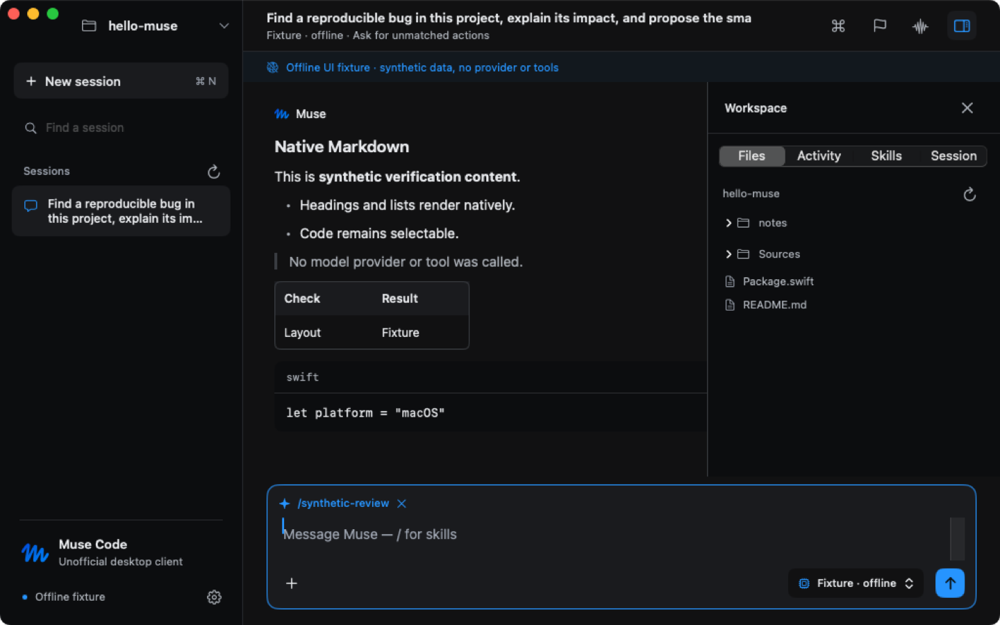

<p align="center">
  
</p>

<h1 align="center">Muse Code Desktop</h1>

<p align="center">A native macOS workspace for the Muse Code CLI.</p>

> [!WARNING]
> **Unofficial desktop client.** This is not the official Muse Code desktop app and is not affiliated with or endorsed by Meta. Muse and its logo belong to Meta.

Muse Code Desktop replaces terminal presentation with a native app while keeping the installed Muse CLI as the execution engine. SwiftUI draws the interface; one supervised `muse serve` process runs the agent over newline-delimited JSON-RPC. There is no webview and no third-party dependency.

## Download

**[Muse Code Desktop v0.1.0 — macOS, Apple Silicon](https://github.com/anon5376/muse-code-desktop/releases/download/v0.1.0/Muse-Code-Desktop-0.1.0-arm64.dmg)**
· [SHA-256 checksum](https://github.com/anon5376/muse-code-desktop/releases/download/v0.1.0/Muse-Code-Desktop-0.1.0-arm64.dmg.sha256)
· [v0.1.0 release](https://github.com/anon5376/muse-code-desktop/releases/tag/v0.1.0)

This is an initial preview build: **ad-hoc signed, not notarized.** Gatekeeper will warn on first open. Apple documents the override: in Finder, Control-click the app, choose **Open**, then click **Open** — the app is saved as an exception and opens normally afterwards ([Apple Support](https://support.apple.com/guide/mac-help/open-a-mac-app-from-an-unknown-developer-mh40616/mac)).

```sh
# Optional: verify the download against the published checksum
shasum -a 256 -c Muse-Code-Desktop-0.1.0-arm64.dmg.sha256
```

The DMG contains only the app. The Muse CLI, credentials, caches, and local settings are never bundled.

## Requirements

- **macOS 14 or later** on Apple Silicon. The v0.1.0 preview ships arm64 only.
- **An installed Muse Code CLI, signed in.** The app discovers `muse` at `~/.local/bin/muse`, common Homebrew locations, or on PATH; Settings can point at another executable. If sign-in is needed, run `muse login` in Terminal. Authentication and your configured approval/sandbox policy remain in Muse — the app does not read credentials and never selects a more permissive mode.

## Install and first launch

1. Open the DMG and drag **Muse Code** to Applications.
2. Open it once through the Gatekeeper flow above.
3. Choose a project folder with **⌘O**, type a prompt, and send with **⌘Return**. The first send creates the session on the host.
4. Before sending, check the model route in the title band. The picker reads Muse's real catalog; an amber **Data use** badge appears when the host supplies a Contributor notice — the picker exposes the full notice.

Approval and question cards wait in a dock above the composer and require an explicit choice; browsing skills or files never dismisses them.

## Demo

[](https://github.com/anon5376/muse-code-desktop/releases/download/v0.1.0/muse-code-demo.mp4)

| Workspace | Model picker | Compact layout |
| --- | --- | --- |
|  |  |  |

## Keyboard shortcuts

| Shortcut | Action |
| --- | --- |
| **⌘O** | Choose workspace |
| **⌘N** | New session (unsaved draft; first send creates the host session) |
| **⌘Return** | Send |
| **⌘.** | Stop the running turn |
| **⌘K** | Skills & commands palette (also `/` in an empty composer) |
| **⌘⌥I** | Toggle inspector |
| **⌘⌃S** | Toggle session sidebar |
| **⌘,** | Settings |

## Features

- **Transcript-first workspace.** Native Markdown replies — headings, lists, quotes, tables, fenced code with Copy — plus tool activity rows with expandable arguments and output.
- **Real model routing.** Searchable picker over Muse's actual catalog; provider/profile routes stay distinct, the configured default resolves to its actual model, and reasoning choices come from advertised variants per session.
- **Skills and commands.** Command-K palette with search, source filtering, and one-click skill attachments; installed skills are checked against the session catalog before sending.
- **Inspector.** Files (read-only preview and **Add to message**), Activity, Skills, and Session tabs that adapt beside or over the conversation.
- **Session controls.** Rename, fork, compact context, interrupt, and stop background tasks through the host; explicit shell commands via Muse's `userShell` capability; goal, agent, and workflow controls where the host exposes them.
- **Honest requests.** Permission and question cards present host choices verbatim and stay visible until answered; multiple requests page in arrival order.
- **Open Muse in Terminal.** Login, plugin/MCP management, voice, and terminal-only commands stay in a separate native CLI session. No editable IDE or embedded terminal pane.

## Architecture

- `Sources/MuseCore` — JSON-RPC transport, wire envelope v1, transcript reducer, request/receipt types.
- `Sources/MuseDesktop` — the AppKit + SwiftUI app: workspace store, transcript, palette, model picker, inspector, request dock.
- `Sources/MuseDiagnostics` — isolated host check against Muse's offline echo provider.
- `Sources/MuseDesktop/Resources/MuseLogo.svg` — the unchanged Muse logo, reused for the app icon tile. See [provenance](docs/brand-assets.md).

The app owns navigation, presentation, process supervision, and explicit answers to host requests. Muse owns authentication, agent execution, tool policy, and durable sessions. Design detail: [DESIGN.md](DESIGN.md), [integration spec](docs/superpowers/specs/2026-10-08-muse-native-design.md), [implementation plan](docs/superpowers/plans/2026-10-08-muse-native.md).

## Build and test

Requires macOS 14+, Apple's Swift command-line tools, and an installed Muse CLI. Verified on macOS 26.4, Apple Silicon, Swift 6.3.1, Muse 1.4.2.

```sh
bash scripts/build-app.sh          # produces build/Muse Code.app (ad-hoc signed)
bash scripts/test.sh               # standalone Swift test executables; no XCTest dependency
bash scripts/swift-local.sh run MuseDiagnostics
```

Tests cover the production transport and store using isolated Muse echo sessions and local protocol fixtures — 14 core tests and 19 workspace checks at last verification; see [verification](docs/verification.md). Reproducible DMG packaging is documented in [docs/packaging.md](docs/packaging.md) (`scripts/package-dmg.sh`).

Settings → **Test local connection** exercises the transport against Muse's offline echo provider in a temporary session — no model request, no workspace tools. To browse the whole UI offline:

```sh
open "build/Muse Code.app" --args --echo --workspace "$PWD"
```

The offline banner stays visible in that mode. Quit the app before rebuilding its bundle.

## Known limitations

- **Preview status.** Live-provider turns, real approval/question decisions, durable session resume, and long-session performance are not yet hands-on verified; see the [acceptance checklist](docs/acceptance.md).
- Session listing shows at most the first 100 entries returned by Muse; search filters that loaded list.
- File scanning excludes hidden files, symlinks, and generated directories; capped at 2,000 entries and 6 levels. Previews are UTF-8 text, max 256 KiB; stored tool output shows its first 256 KiB. Patch retrieval is not implemented.
- Wire envelope version 1 is required; a schema fingerprint mismatch shows as a warning. New Muse releases can require client updates.
- Reconnection never resubmits a prompt automatically.
- Pending requests set a Dock badge and request attention; system notifications and global approve/deny shortcuts are not implemented.
- No faster inference or tool execution is claimed — native rendering targets interface responsiveness only.
- Transcript rows are measured eagerly to avoid a known resize layout loop; long-session cost is unmeasured.
- arm64 build only; no Intel or universal artifact yet.
- Shutdown bounds the host-drain and termination wait; whole-process-group cleanup of arbitrary tool descendants is unverified.

## License

The wrapper source is under the [MIT License](LICENSE). The separately installed Muse CLI is not included. **Muse and its logo belong to Meta; the bundled logo and trademarks are not covered by this project's MIT license** — see [logo provenance](docs/brand-assets.md).
